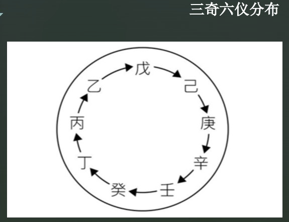
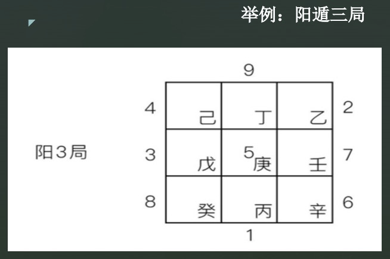

# 第1章 奇门遁甲基础

## 1.1 奇门遁甲的起源与发展

奇门遁甲是中国古代术数三式之一。 这三式是太乙，六壬，奇门。

### 1.1.1 周易的起源

先说“易”字，从说文解字里解释的是蜥蜴的意思，即大壁虎。最开始的意思是蜥蜴，又因为有的蜥蜴是变色龙，可以根据环境而变化颜色，所以其后来延伸的意思是变化。另外一个说法是来自于秘书，即日月为易。上为日，下为月，日月合在一起就是易，也就是说易有阴阳更替变化，周而复始的意思，来源于甲骨文象形文字。所以易还包括感应和变化的意思。综上，易表示了两个事物的之间的感应和变化，而且还随着时间而变化。

“周”字代表着周朝。其实易经总共有三个版本，即夏朝的《连山易》，商朝的《归藏易》，然后就是《周易》。前两个版本都已经失传了。夏朝的《连山易》，仅存连山八卦图(源于伏羲八卦图)，艮卦起首。商朝的《归藏易》，坤卦起首，其归藏八卦图是由伏羲八卦图旋转180度而来的。只有《周易》有幸存于后世，上半部分是经，下半部分是传。

### 1.1.2 奇门遁甲的起源

奇门遁甲的技术理论历经周，秦，汉，唐，明清等各个朝代的发展，在各个时代有不同的叫法，在周朝称之为阴符，汉朝称之为六甲，隋唐开始到宋代，称为遁甲，明清时期被称之为奇门遁甲，直到今天。

### 1.1.3 奇门遁甲四个字的意义

- “甲”在奇门遁甲中的地位相当于统帅，属于最高级别。
- 而所谓“遁甲”，是隐藏统帅让其他系统安心地运筹帷幄。
- 而“奇”有三奇，即乙奇，丙奇，丁奇，这三奇是用来辅佐统帅“甲”的，其中乙奇类似于总参谋长，丙奇总警卫长，丁奇类似于总后勤部长。
- 门在奇门遁甲里代表的是人事，一共有八门：休，生，伤，杜，景，死，惊，开。

奇门遁甲技术是易经的一种应用。遁甲的本质是信息学，概率论，逻辑学的交叉学科。它首先收集很多信息，然后进行逻辑推理，得出一个概率比较高的结论，这就是奇门遁甲的思维过程。

### 1.1.4 奇门遁甲的发展

根据《烟波钓叟歌》记载：

- 黄帝初创造4320局，即一年360天，一天12时辰，总共4320局。
- 风后简化为1080局，即每隔四个局是一样的。
- 姜太公简化为72局，及24节气，每个节气的十五天，分成三等份，总共72局。
- 张良最后简化为18局

### 1.1.5 奇门遁甲的类型

#### 1.1.5.1 根据时间分类

- 年加奇门，以年起局，判断流年的情况。
- 月加奇门，以月起局，判断流越的情况。
- 日加奇门，以日起局，判断流日的情况。
- 时加奇门，以时辰起局，这种类型用的更多，因为可以更加细致得反应了事情的变化。

#### 1.1.5.2  按照排盘方法

- 转盘法奇门
- 飞盘法奇门

我们经常使用转盘法奇门。

#### 1.1.5.3 根据用途

- 数理奇门，主要是用来预测。
- 法术奇门，是将奇门与道家法术结合在一起运用。

### 1.1.6 奇门遁甲的参数简介

#### 1.1.6.1 空间参数（17个）：

- 八卦：乾，坤，震，巽，坎，离，兑，艮。
- 九宫：九宫格

#### 1.1.6.2 时间参数（22个）

- 天干：甲，乙，丙，丁，戊，己，庚，辛，壬，癸。
- 地支：子，丑，寅，卯，辰，巳，午，未，申，酉，戌，亥。

#### 1.1.6.3 外环境参数（9个）

九星：
>天蓬星，天任星，天冲星，
 天辅星，天英星，天芮星，
 天柱星，天心星，天禽星。

#### 1.1.6.4 人际关系参数 (8个)

八门：
>休，生，伤，杜，景，死，惊，开。

#### 1.1.6.5 不可知的外力 (8个)

八神：
> 值符，腾蛇，太阴，六合，白虎，玄武，九地，九天

这八个外力有可能是有帮助的，也可能是有害的。

### 1.1.7 三奇六仪的详细介绍

奇门遁甲中的十个天干被分别称之为：遁甲，三奇，六仪。其中甲是统帅，他有三个重要的辅佐元素，即乙奇，丙奇，丁奇。

#### 1.1.7.1 三奇

我们再来说一下这三奇的由来：

- **乙奇**：因为天干有五合，其中有一组是乙庚相合，庚五行属金，在天干中庚金是要克甲木的，因为这里面包含了一个概念，是金克木，很容易就会把统帅甲克死。那这个时候，乙木作为甲木的妹妹，那就要跟庚金结合为夫妻。这样庚金就成了甲木的妹夫。他就不会再去危害甲木了。因为乙有这样的能力，所以被称之为乙奇。
- **丙奇**：因为丙五行属火，甲五行属木，甲木生丙火。所以呢，甲木是丙火的父亲，而火又能克金。所以呢就相当于儿子去保护了他的父亲。这就是丙奇可以保护统帅甲的原因，所以被称之为丙奇。
- **丁奇**：丁火是属于阴性的。又因为甲木生丁火，相当于甲木生了一个阴性的孩子，阴性的孩子也就是相当于女儿。这个女儿呢，也是火，也能克金。所以呢他有这样的能力去保护父亲，所以被称之为丁奇。

这三奇中，乙奇也叫做美人奇，就相当于嫁出去的妹妹，丙奇也叫儿子奇，丁奇也叫做女儿奇。

#### 1.1.7.2 六仪

六仪代表着六支军队。从戊开始，戊，己，庚，辛，壬，癸。六个甲实际上代表着六个统帅。大统帅是甲子戊，他率领第一支军队。甲子元帅就隐藏在戊这支军队里。这里有个概念是在奇门遁甲局中是不存在甲这个符号的，甲是统帅，他要隐遁在其他六支军队里面。下面还有五个甲，都是副统帅，分别是：

- 甲戌元帅，统领己这支军队。
- 甲申元帅，统领庚这支军队。
- 甲午元帅，统领辛这支军队。
- 甲辰元帅，统领壬这支军队。
- 甲寅元帅，统领癸这只军队。
- 甲子元帅，统领戊这支军队。

所以甲是不能露面的，隐藏在六仪里面，叫做遁甲。

## 1.2 阴阳遁局的判断与符号类象



### 1.2.1 三奇六仪的分布

那我们现在看来看一下上面这张图，即三奇六仪的排布顺序，一个元帅甲，加上三奇六仪，他们在奇门遁甲局中要排成一个太极阵，这个镇是一个环形的圈，其顺序是从戊开始到己，然后再从己到庚：戊己庚辛壬癸丁丙乙。

三奇六仪永远按照这个方式来排列循环，然后再确定是哪种奇门局。有两种奇门局，一个叫阳遁局，一个叫阴遁局。阳遁局。就是围着这个圆环顺排，阴遁局就是要逆排，这就是所谓的阳顺阴逆。这个阳顺阴逆这个概念非常重要，那为了避免出错，我们编制了数字放在奇门局里面。

### 1.2.2 阴阳遁局的判断

区分阳遁局和阴遁局的方法是用节气。二十四节气中的冬至，简称冬至一阳生，对应的六十四卦叫地雷复卦，复卦也叫一阳生，所以简称复卦一阳生。因为冬至和副卦是相对应的。所以从冬至开始往前走，阳气是不断上升的，一直到夏至的前夕，阳气达到了极大值。这个过程就是阳气上升的过程，在这段时间发生的奇门局就叫阳局，也叫做阳遁局。

到了夏至，阴气开始产生了，所以我们叫夏至一阴生，他呼应的是天风后卦。后盖被称为以音声。从夏至开始往前走到冬至前夕，整个阴气是不断地积蓄的过程。这个时间段发生的奇门局，我们就叫阴局，也叫阴遁局。

### 1.2.2 奇门图的排局

比如一局，就意味着第一只军队戊要在坎一宫，同理五局的话，戊就要在五宫，六局的话，戊就在六宫。把三奇六仪用数字代替，然后再代入奇门局中，他们的顺序永远是戊己庚辛壬癸丁丙乙。

首先按照这个顺序，8，3，4，1，9，2，7，6的顺序填到九宫格，5放到最中间的，如下图：

4 | 9 | 2
--- | --- | ---
**3** | **5** | **7**
**8** | **1** | **6**

如果是阳三局，则将干支环上第一个干支“戊”放到编号为3的cell中，根据阳顺阴逆的原则，接连将己庚辛壬癸乙丙丁依照自然数升序填入九宫格，结果如下图：



反之，如果是阴遁局，第一个干支入宫的方法和阳盾局是一样的，但是要逆时针，即按照戊己庚辛壬癸乙丙丁的顺序，但是要按照自然数降序的顺序填入九宫格，例如阴四局如下图：

