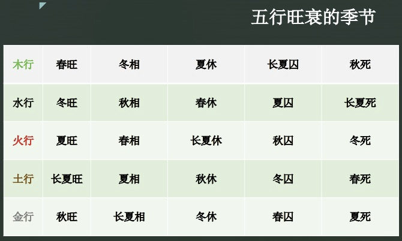

# 第2章 阴阳五行

## 2.1 阴阳基本介绍

阴阳五行是两个不同的概念。阴阳学说将宇宙万物万象分为阴阳两大类，认为一切事物的形成变化以及发展都是在阴阳二气的运动之中。

自然界一切事物都存在着相反的两种属性，也就是说，存存在着对立的统一。最初的阴阳现象来自于阳光的向背，物体向阳的一面为阳，背面的一面为阴，到如今阴阳不断的被引申解释为自然与社会的所有现象，比如说明暗，寒热，日月，昼夜，内外，动静，上下，黑白，快慢，男女，等等。而阴阳的关系呢，又不是一成不变的，它随着外界条件的变化而转化，并且阴中有阳，阳中有阴，相互包含着。

阴阳的特征：

1. 阴阳互为根，阴为阳根，阳为阴跟，互为依存，互相为用。
2. 阴阳消长，阴阳始终处于此消彼长彼进此退的动态平衡中。
3. 阴阳转化，在一定的条件下呢，阴阳发生质的变化，各自向其对立的面转化。

阴阳学说与现代唯物辩证法的矛盾对立统一规律是完全相符的。这也就是说，我们在看待事物的时候，不能片面的，静止的去看，而是应该用全面发展的眼光去看。我们所说的没有吉没有凶的观点理论基础就是阴阳学说的认识论。

## 2.2 五行的基本介绍

司马迁在《史记》里面写道：“黄帝考订星历，建立五行”。这说明五行首先是通过观察天文现象而得到的。天文现象说，天上有五行，那实际上指的是天上有五颗星。天上的五颗星，距离太阳的距离各不相同，最远处是木星，然后是火星，然后土是地球，再然后是金星，水星。

五行学说认为，宇宙万物都是由木，火，土，金，水，这五种基本物质的运行和变化所构成的。五种物质是相互滋生，相互制约，处于不断地运动变化之中。阴阳包括五行，五行含有阴阳。宇宙间的一切事物，根据其属性，可分为两类，阴勒和阳类。任何一个具体的事物都是具有阴阳两重性，即阴中有阳，阳中有阴，进一步系统地分成了五大类，金，木，水，火，土。

天上有五颗星，地上有五行，反映在我们的身体上，脸上就有五官。五官也对应着五行，耳朵属水性，眼睛属木性，鼻子属金性，嘴巴属土性，伸出来的舌头为火性。我们每个人都有五根手指，五个脚趾，这都是有五行的。所以五行是一个包含天地人的普遍现象。

五行的相生关系：

- 金生水；
- 水生木；
- 木生火；
- 火生土；
- 土生金；

五行的相克关系：

- 火克金；
- 金克木；
- 木克土；
- 土克水；
- 水克火；

## 2.3 五行的数值系统

五行的数字在奇门遁甲里往往是用来断事情的。比如说预测这件事情什么时候发生，多少天，多少月，乃至多少个小时以后将会发生。另外，这个项目需要投资多少钱，比赛的分数等等，都是需要用数字表示的。

### 2.3.1 五行数值的来历

那么五行的数字是怎么定下来的？我们来看古老的著作《尚书.洪范篇》，这里面提到了这个问题：

- “一曰水”, 水的数字就是一。
- “二曰火”，火的数字就是二。
- “三曰木”，木的数字就是三。
- “四曰金”，金的数字就是四。
- “五月土”，土的数字就是五。

这样就出现了，一，二，三，四，五，这五个数字。但是每个五行元素都有两个数字，所以又有文字记载，天一生水，也就是说，一经过天转循环五行以后，生出了水，那就是循环了五次，就是一加五，天一生水就是六，这是由一加五而得出的。天二生火，火进行了天的五行循环，二加上五又变成了七。同理下面的天三生木就是八，天四生金就是九，天五生土就是十。所以总结如下：

- 水，一和六。
- 火，二和七。
- 木，三和八。
- 金，四和九。
- 土，五和十。

## 2.4 五行的关系

五行的关系有四种：相生，相泄，相克，相耗。

### 2.4.1 相生相泄

那我们先来说一下五行的相生。我们把五个五行元素连起来，画出一个圆形，这个圆形箭头所指从水开始：

- 水生木，有了水，树木花草生长；
- 木生火，燃木取火；
- 火生土，火可以把所有的东西烧成灰土；
- 土生金，土埋在地底下长年累月经过化学的变化就变成了金属矿物；

所以呢，这个循环称为五行相生。

相生反过来就是相泄。因为你生了我，我反过来就会把你的能量给泄掉了。所以又有如下相生相泄的关系：

- 水生木，反过来木泄水。
- 木生火，反过来火泄木。
- 火生土，反过来土泄火。
- 土生金，反过来金泄土。
- 金生水，反过来水泄金。

如下图所示：


### 2.4.2 相克相耗

下面是相克和相耗的关系。实际上就在这个圆环里画个五角星就可以了。比如说金指向木，金克木，用斧头可以砍断木头；木指向土，木克土，树木的根长出来将土推开；土克水，水来土掩；水克火，火克金，火可以把金属熔化掉，那这就是五行相克的关系。

相克反过来叫做耗。金克木，金就被磨掉了一点点，就像你用斧头去砍木头，砍到最后你的斧头很可能就卷刃了。消耗的关系有木耗金，土耗木，水耗土，火耗水，金耗火。如下图所示：



### 2.4.3 五行五方的关系



上图中是五行五方的表格，即：

- 木为东方，为春季，五脏属肝，五官属目。
- 火属南方，为夏季，五脏属心，五官属舌。
- 土为中方，为长夏(包括小暑大暑)，五脏属脾，五官属口。
- 金为西方，为秋季，五脏属肺，五官属鼻。
- 水为北方，为冬季，五脏属肾，五官属耳。

## 2.5 五行的旺衰状态

五行本身还有旺和衰的特点，它的旺衰状态共有五种，分别是，**旺，相，休，囚，死**。

### 2.5.1 五种基本的旺衰状态

第一个类别有两种，旺和相。

- 首先，同我为旺，跟我一样的五行元素就是旺的，比如说我是木，处在木的环境里，就是一种旺的状态；
- 第二种是相，生我为相。也就是说，我处在生我这个五行元素的环境中的时候，我这个五行元素也是有这个力量的。比如说我是木型，处在水的环境下，水生木，那我就是处在一个相的状态。

在这里，旺和相都是比较兴旺的一种状态，能量比较充足。

第二个类别有三种，即休，囚，死，他们都是一种衰落的状态。

- 生，我生为休，我去生了别人，那我就没有力量了，我就要休息。
- 囚，我去克了别人，也就是消耗了体力，相当于被困住了一样，所以说呢，是我克为囚。
- 死是最没有能量的一种状态，克我为死，那就是把我克死了。

休囚死的状态对于五行来讲，就是三种最衰弱的状态。

### 2.5.2 五行的旺衰季节

首先四时是指春夏秋冬四个季节。

- 春季里万物复苏，以木为当令者，木为旺。
- 夏季为流火之际，以火为旺。
- 秋季为金黄收获之际，以金为旺。
- 冬季为寒冷凝水之季，以水为旺。

五行的旺衰季节，总结如下：

- 木型，春旺，冬相，夏休，长夏囚，秋死。
- 水型，冬旺，秋相，春休，夏囚，长夏死。
- 火型，夏望，春相，长夏休，秋囚，冬死。
- 土型，长夏旺，夏相，秋休，冬囚，春死。
- 金型，秋旺，长夏相，冬休，春囚，夏死。

## 2.5.3 五行的反克

相克的时候，如果能量状态不同，会出现反克。比如说木和金，我们现在已经知道金克木，但是如果木的能量状态特别旺，金的能量状态特别弱，我们就叫做木旺金囚，就像你用一把很小的斧头，去砍一棵苍天的大树，那结果就是斧头不行了，大树还依然挺立着。所以这个概念需要我们要建立起来，如果五行被克的那一方很兴旺，是要反克的。所以今后判断奇门局的时候，不要太教条。

## 2.5.4 其他参数的旺衰状态

除了五行有这五种状态以外。在奇门遁甲中的全部64个参数中，除了十个天干有12种地支能量状态以外，其他的参数都只有五种能量状态的，即旺，相，休，囚，死，这些都是紧密的关联的五行的知识。