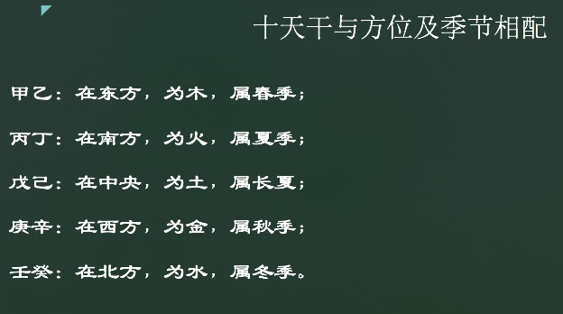
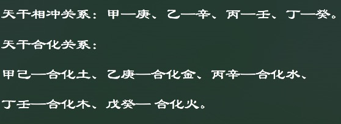
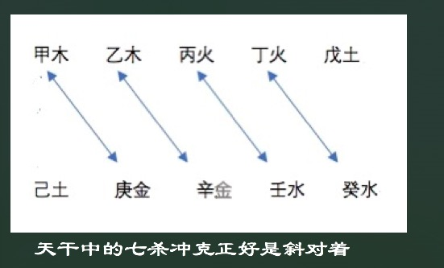
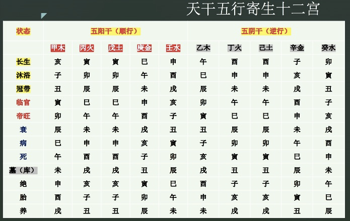

# 第2章 阴阳五行

## 2.1 天干

首先来讲一下第一部分：天干。十个天干，分别叫做：甲乙丙丁戊己庚辛壬癸。甲叫做遁甲，乙丙丁叫做三奇，我们可以简称为乙奇，丙琦，丁奇，也分别可以叫做：日奇，月奇，星奇。

甲是拆的意思，指万物抛甲而出。
乙是扎的意思，指万物出生抽轧而出
丙是丙的意思，指万物必然铸件。
丁是强的意思，指万物丁壮。
戊是茂的意思，指万物茂盛。
己是迹的意思，指万物有形可迹。
庚是更的意思，指万物收敛，有实。
辛是新的意思，指万物初心。
壬是任的意思。只阳气任养万物之下。
癸是窥的意思，指万物可窥度。

### 2.1.1 天干之阴阳

由此可见呢，十天干与太阳出没有关。而太阳的循环往复的周期性运动对万物产生直接的影响。十天干有阴阳属性，十天干分为阴干和阳干，单数为阳，双数为阴。阳干为，甲，丙，戊，庚，壬；阴干为，乙，丁，己，辛，癸。

### 2.1.2 十天干之五行属性

- 甲乙同属木，甲为阳木，指的是栋梁之木，乙为阴木，比如说花草之木；
- 丙丁同属火，丙为阳火，属于太阳之火，丁为阴火，属灯烛之火。
- 戊己同属土，戊为阳土，即城墙之土。己为阴土，即田园之土；
- 庚辛同属金，庚为阳金，斧钺之金，辛为阴金，属于首饰之金；
- 壬癸同属水，壬为阳水，江河之水，癸为阴水，雨露之水。

### 2.1.3 十天干与方位以及季节的关系

甲乙在东方，属木，属春季。
丙丁在南方，属火。属夏季。
戊己在中央，属土，属长夏。
庚辛在西方，属金，属秋季。
壬癸在北方，属水，属冬季。

### 2.1.4 十天干的冲合关系

天干相冲，有甲和庚，乙和辛，丙和壬，丁和癸。这个冲呢，也是一种克，因为方位相对，所以力量比较大。天干合化关系，甲己合化土，乙庚合化金，丙辛合化水，丁壬合化木，戊癸合化火。这个合是合化合解的意思。在奇门预测男女婚恋时，以相合之干为配偶和对象。甲己合为中正之合，乙庚合为仁义之合，丙辛合为权威之合，丁壬合为淫荡之合，戊癸合为无情之合。

接下来我们来讲一下天干的五合与冲克。天干的五合就是每两个天干，合成一个五行。有五对天干，所以叫做天干五合。

- 第一对，甲己，甲己合化土。甲己相合，叫甲己合化土，甲和几在一起为什么会合成土呢？甲是木，他生长在土里面。因此，如果甲木最后枯萎了，那么他就会烂在土里面，最后就变成了土，所以甲己最后要合化成土的。
- 第二对，乙庚合化金。 乙和庚为什么要合化成金呢？乙是阴木，阴木指的是在地底下的木，那么地底下的木长年累月得就会慢慢发生变化，最后呢，就会变成乌木。乌木太坚硬了，可以把它看成是金属类的东西，叫乌金，所以乙庚合金。
- 第三对，丙辛合化水。丙和辛在一起，为什么能合化成水呢？因为丙是火，辛是金。火把金融化了，最后就都会变成像水一样。
- 第四对，丁壬合化木。因为丁代表阳光，壬代表雨露。在阳光雨露的作用下，最后造成了一个微小的植物的生长，变成了木，所以成为丁壬合化木。
- 第五对，戊癸合化火。戊是土，癸是水，戊在上面，下面呢就是水，那么底下的水指代的是液体，有两种：一种是地下水，一种是地下的岩浆。流动的滚烫的液体一旦爆发出来，就是火山爆发。他是以火的形式出现的，所以说戊癸合化火。

### 2.1.5 七杀

下面我们再来讲一下下图所示的七杀。他也是天干冲克的一种，因为从甲到庚正好排出了七个天干。甲乙丙丁戊己庚,总共有七个，所以庚金克甲木，我们就叫他七杀，下面辛金克乙木，壬水克丙火，癸水克丁火，为什么也叫七杀呢？那我们用同样的方法思考一下，其实就很容易得到答案了。

## 2.2 地支

然后我们来说一下地支，即：子，丑，寅，卯，辰，巳，午，未，申，酉，戌，亥。从文献上记载来看，黄帝时代就有了十二地支。都代表着每年十二个不同的月令节令。十天干与地支结合运用，用于记年，记月，记日，甚至是记时。

### 2.2.1 地支的阴阳五行属性

十二地支和十天干一样都具有阴阳属性。十二地支分为阴支和阳支。单数为阳，双数为阴，所以阳支有：子，寅，辰，午，申，戌，阴支有：丑，卯，巳，未，酉，亥。

十二地支同样具有五行属性：

- 子亥同属水，子为阳水，亥为阴水。
- 寅卯同属木，寅为阳木，卯为阴木。
- 午巳同属火，午为阳火，巳为阴火。
- 申酉同属金，申为阳金，酉为阴金。
- 丑辰未戌同属土，辰戌为阳土，丑未为阴土，为四季土。

## 2.2.2 地支的记月与记时

十天干和十二地支依次相配组成六十个基本单位。古人用以此作为年月日时的序号，叫干支记法。地支在与天干组合记月时，在干支中所用的地支名称是固定不变的，来表示每年的十二个月。正月为寅月，二月为卯月，三月为辰月，四月为巳月，五月为午月，六月为未月，七月为申月，八月为酉月，九月为戌月，十月为亥月，十一月为子月，十二月为丑月。

所谓一天内的计时也是采用十二地支来表示每天的十二个时辰，每个时辰相当于现在的两个小时：

- 子时对应23点到1点。
- 丑时一点到三点。
- 寅时三点到五点。
- 卯时五点到七点。
- 辰时七点到九点。
- 巳时9点到11点。
- 午时11点到13点。
- 未时13点到15点。
- 申时15点到17点
- 酉时17点到19点。
- 戌时19点到21点。
- 亥时21点到23点。

### 2.2.3 十二地支的冲合刑害的关系

#### 2.2.3.1 地支之冲合

地支之间相距六位是相冲的关系，其中：

- 子与午相冲。
- 丑与未相冲。
- 寅与申相冲。
- 卯与酉相冲。
- 辰与戌相冲。
- 巳与亥相冲。

既然有相冲的关系，就必然有合的关系来对应。地支有六冲，对应的就有六合：

- 子丑合。
- 寅亥合。
- 卯戌合。
- 辰酉合。
- 巳申合。
- 午未合。

#### 2.2.3.2 地支之三合三会

地支还有三合，就是三个地支相合：

- 申子辰合化水。
- 寅午戌合化火。
- 亥卯未合化木。
- 巳酉丑合化金。

地支三会：

- 寅卯辰会木局。
- 亥子丑会水局。
- 申酉戌会金局。
- 巳午未会火局。

#### 2.2.3.3 地支之刑害

地支相刑：

- 子刑卯，卯刑子。
- 寅刑巳，巳刑申，申刑寅。
- 丑刑戌，戌刑未，未刑丑。
- 辰刑辰，午刑午，酉刑酉，亥刑亥。

地支相害：

- 子未相害，丑午相害，寅巳相害，卯辰相害，申亥相害，酉戌相害。

但是相害在奇门运用中比较少，我们只要了解一下就可以。

天干地支五行的生，克，会，合，冲，刑，害，这几种关系的具体含义如下：

- 生，就是增强；
- 克，就是减弱；
- 会，就是强烈的改变原来的本质；
- 和，就是中立地改变原来的本质；
- 冲，就是破坏；
- 刑，就是连累；
- 害，就是相互损害的意思；

### 2.2.4 五行和四时五方的关系

五方，是指东南西北中五个方位。五行及其代表的天干地支各有所主的方向：

- 东方主甲乙寅卯，属木。
- 南方主丙丁巳午，属火。
- 西方主庚辛申酉，属金。
- 北方主壬癸亥子，属水。
- 中方主戊己辰戌丑未，属土。

四时也是四季：

- 夏季为流火之季，以火为旺，所属干支为丙，丁，巳，午，未。
- 秋季为金黄收获之季，以金为旺，所属干支为庚，辛，申，酉，戌。
- 冬季为寒冷凝水之季，以水为望，所属干支是壬，癸，亥，子，丑。
- 辰戌丑未为四季土旺。

## 2.3 天干五行寄生十二宫

五行不仅在一年四季中有，**旺，相，休，囚，死**的状态，而且与地支所代表的12个月相对应，还有一个从生长到死亡的全过程，这个就叫做寄生十二宫的原理。十天干相对于十二地支，有十二种状态，分别是长生，沐浴，冠带，临官，帝旺，衰，病，死，墓，绝，胎，养，它的排列规律是阳死阴生。

现在先简单介绍天干五行寄生十二宫的状态，及其含义：

- 长生，就像人出生于世，或者是降生的阶段。是指万物萌发之际，他引申的意义有很多。但在现实中包括，有出生，生长，来源，起点，帮助，依靠，靠山，源泉，获取，产生等等含义。

- 沐浴，是洗礼与生长的意思，又叫“败”。形体柔又很脆弱，易为所损，它还有洗澡，裸体，淫乱，暴露，光滑，坦诚，睡觉，破坏等含义。

- 冠带，是指小孩子可以穿衣戴帽了，是指万物逐渐欣欣向荣。冠带还有穿衣整装，包装，装饰，衣服，荣誉，遮盖，外表，高贵等含义。

- 临官，像人长强壮了，可以做官领导人民了，指万物长成。还有公家，官府，巴结当官的，阿谀逢迎，出事，当官，有官运，有地位。公务员等等这些含义。

- 帝旺，象征着人壮盛到极点，可辅助帝王大有作为，以及万物成熟，此外还有荣发，发达，得意，精神，兴奋，神气，有利，雄壮，强大，辉煌，顶点，等这些含义。

- 衰，指盛极而衰，万物开始发生衰变了，它含有无力，软弱，衰弱，不景气，败落，退缩，没有靠山，虚弱无能，等这些含义。

- 病，如人患病，指的是万物困顿，病还有其他意思，包括疾病，讨厌，仇人，不足之处，缺点，毛病，弱点，漏洞，问题，等等。

- 死，如人气已尽，形体已死，是指万物死灭。死的其他意思包括死亡，钻牛角尖，不灵活，不变通，滞留，终结，没有余地，无生气，无活力，呆板，笨拙，心胸狭窄。寂静等等。

- 墓，也称墓库，像人死之后归于墓，也指万物成功后归库了。木还有的意思包括：包容，收藏，埋藏，关闭，存放，管制，包含，陷阱，不自由，受约束，隐藏，昏沉，糊涂，黑暗，不畅通等等。

- 绝，人形体绝灭，化归为尘土。万物前气已决，后继之气还没到来，“以万物在地中，未有其相”。绝还有的意思包括：绝地，绝境，悬崖，分手，断绝，失望，心灰意冷，无情，冷酷，不通融，消失，无影无踪，此外还有把事做绝，把话说绝，等等这些意思。

- 胎，意思是人受父母之气，凝聚成胎儿，天地气交之际，气来受胎。它含有的意思是包括：怀胎，酝酿，计划，形成，天生，本性，幼稚等等。

- 养，类似人养胎于母腹之中，之后才会出生，是指万物在地中成形，继而萌发，又得经历一个生生灭灭永不停止的天道循环过程。养包含的意思有寄托，收养，休养，疗养，营养，滋养，培养，养育，扶持等等。

总之，寄生十二宫的现象比较形象地反映了宇宙万物，生生死死，循环往复，永无休止以至无穷的自然状态与规律。它体现了古代人民朴素的唯物观和合理的科学哲学思想。

下面是天干五行寄生十二宫的状态表：



## 2.4 天干的类象

### 2.4.1 甲

属于阳木，位于东方，五脏六腑属于胆，体表属于头部，五味为酸味，颜色青绿色。反映出的性格是刚健，直爽，体型高大。得令的时候。甲木为栋梁，失领的时候是被闲置的材料。性格比较自负，不能够灵活地出事。在奇门遁甲中，是统帅，是首脑。因为遁甲，所以它是隐藏在六艺之中的。是在奇门局中，是没有甲这个符号的。

### 2.4.2 乙

属于阴木，也是位于东方，五脏六腑属于肝，体表表示脖子和肩膀，五味主要是酸甜，颜色是浅绿色，性格柔和，体质柔嫩。得令的时候茂盛，失令的时候枯萎，为人比较柔顺，依附于世俗之中。在奇门遁甲中，称为乙奇，也叫做日奇，它的类相为中医，为女子，为妻子。那他的内向，大家要记得清楚一些哦，这个以后要经常用到的。

### 2.4.3 丙

属于阳火，位于南方，五脏六腑主小肠，体表主肩膀和额头，五味主苦辣，颜色为紫红色。性格比较火烈，清廉，得令的时候成绩辉煌，失令的时候容易心灰心丧气。可以成大才。但是持久性比较差。在奇门遁甲中叫丙奇，也叫月奇，它代表了有权威的人，代表了女方的男情人，第三者。

### 2.4.4 丁

属于阴火，也是位于南方，因为“丙丁南方火”，一个是阳火，一个是阴火。五脏六腑属心脏，体表代表胸部，舌头，五味主苦，颜色为淡红色，形体秀丽，性格温和，但是很有心计。得令的时候，明察秋毫，失令的时候，忧愁焦虑。在奇门遁甲中被称为丁奇，也叫星奇。他的类向为玉女，为南方的女情人。

### 2.4.5 戊

属于阳土，位于中央，五脏六腑为胃，体表表示肋骨和鼻子，五位主要甘辛，颜色为深黄。性格刚烈，形体厚实。得令的时候豪放果敢，失令的时候发呆。在奇门遁甲中也是很重要的符号，它代表了资本，代表了聚财，代表了天门。

### 2.4.6 己

属于阴土，也是位于中央，五脏六腑为脾，体表主要是腹部和面庞，五味为甘辛，颜色浅黄，性格温顺，形体沉稳。得令的时候呢，可以去教化万物，失恋的时候洁身自好。在奇门遁甲中代表了坟墓，代表了地底下的东西，也叫坐地户。

### 2.4.7 庚

属于阳金，位于西方，五脏六腑为胃，大肠，体表属于筋骨，五味为辛辣，颜色主白色，庚金体型高大，性格锐利，得令的时候是比较强硬的，失令的时候，丧失了威望。在奇门遁甲中，代表了丈夫，公安，干警，也代表仇人，也代表大型的刀具。

### 2.4.8 辛

属于阴金，位于西方，五脏六腑为有肺，体表为胸部和屁股，五味为苦辣，颜色是浅白色，体型方正，性格镇静。得令的时候，是良好的材料，失令的时候变成瓦砾。在奇门遁甲中代表了内向，错误，罪人，精子，小型的刀具。

## 2.4.9 壬

属于阳水，位于北方，五脏六腑主膀胱，体表为小腿。五味主咸，颜色深黑色，性格揉弦，可共患难，但是难以同甘甜，得令的时候被人利用，失令的时候会防人害伯。在奇门遁甲中代表流动，因为水是流动的，也代表物流，也代表化学工业，因为化工一定是跟水打交道的。

## 2.4.10 癸

属于阴水，位于北方，五脏六腑为肾，体表为嘴。五味咸着，颜色浅黑，性格阴柔。容易涉及阴谋。得令的时候狐假虎威，失令的时候灰心乞怜。在奇门遁甲中代表了地下水，比如说石油，因为暗中所干的事。也可以代表性生活。以及胎儿。