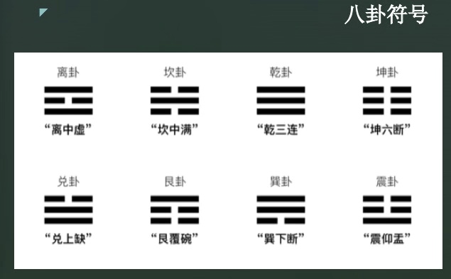
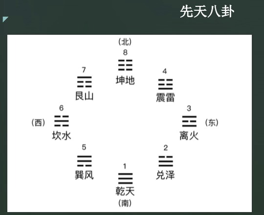
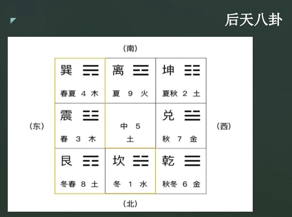
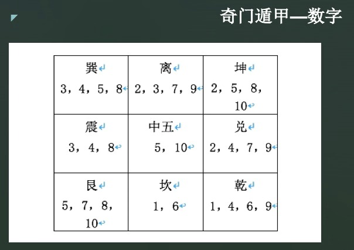
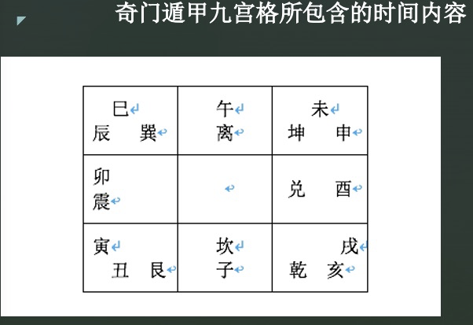
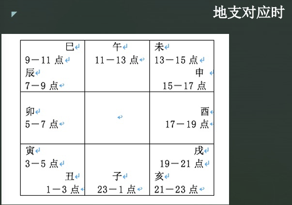
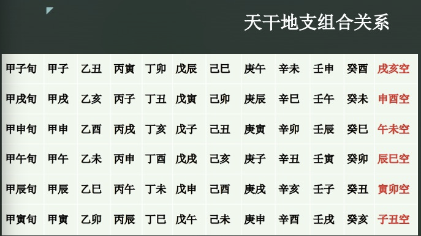

# 第四章 空间与时间

## 4.1 空间之八卦

第一部分先了解奇门遁甲所包含的空间内容。奇门以**九宫八卦**作为排盘的基础，作为地盘。九宫源于洛书，代表这九个不同的方位。

### 4.1.1 八卦的基本介绍

八卦是易经中的基本图形。八卦是怎样产生的呢？在周易系辞中说，太极生两仪，两仪生四象，四象生八卦。首先说太极生两仪，太极是天地混沌，阴阳未分时的元气状态，天地犹如鸡蛋，后来盘古氏开天地，定乾坤，两仪就是天和地。然后是两仪生四象，即阴与阳，继续演变，其随后相冲或相交，产生出，老阳，老阴，少阳，少阴，四象。这四项呢，象征着四时四方等现象。最后是四象生八卦，四象再继续演变，就产出了上述的八卦，分为八节八方等现象。

我们看一下上图中的八卦的符号：离卦，坎卦，乾卦，坤卦，兑卦，艮卦，巽卦，和离卦。卦是分为阳爻和阴爻的，直线是阳爻，虚线是阴爻。

### 4.1.2 八卦的五行属性。

坎属水，离属火，乾和兑属金，震和巽属木，坤和艮属土。这里面有没有注意一下哦？奇门预测的冲刻就是以八卦的宫位的五行来确定的。比如说用神落震宫属木，那么会克坤土宫又受兑公金所冲克。

### 4.1.3 八卦的符号

阳的符号叫阳爻，用一条实线表示。阴的符号叫阴爻，用两条短线表示，每个八卦三个阴阳爻，简称三爻卦。

### 4.1.4 先天八卦与后天八卦

为何八卦还有先天后天一说？以哲学的观点来说，宇宙万物没有形成之前，就是所谓的“先天”，有了宇宙万物后，那就是后天。如果从人的方面来说，出生之前就是先天，出生之后就是后天。从事物的发展方面来说，还没发生的事情叫做先天，已经发生过的事情叫做后天。先天后天的概念是用来划分阶段，范围的。

#### A. 先天八卦

先天八卦又称为伏羲八卦图。先天八卦与后天八卦的排列，象征方位以及包含的数字都有所不同。

先天八卦所主的就是：

- 乾为南方，数字为1，与坤相对。
- 坤居北方，数字为8，与乾相对。
- 震居东北，数字是4，与巽相对。
- 巽居西南，数字是5，与震相对。
- 离居东方，数字是3，与坎相对
- 坎居西方，数字是6，与离相对。
- 艮居西北，数字是7，与兑相对。
- 兑居东南，数字是2，与艮相对。

#### B. 后天八卦

后天八卦是周文王创制的，又称文王八卦图。后天八卦描述的是自然界成型后的气场，更倾向于人类的实际生活。后天八卦图中每相对两个方向的卦数之和为10，而十是偶数，为阴，先天八卦为阳，代表天。后天八卦为阴，代表地。在奇门遁甲中利用的八卦是后天八卦，同时利用先天八卦的卦数。

所谓奇门遁甲九宫格是把先天八卦，后天八卦都包括在内的的一个阴阳合一，天地合一的整体空间模型。地球上的万物之主是人，则：

- 乾卦代表老父，老男人；
- 坤卦代表老母，老年妇女；
- 震卦代表长男，坎卦代表中男，艮卦代表少男；
- 巽卦代表长女，离卦代表中女，兑卦代表少女。

所以组成了天地人三才都在奇门的立体九宫格内。

后天八卦的细节如下：

- 离卦，南方，五行属火，数字是9，与坎相对。
- 坎卦，北方，五行属水，数字是1，与离相对。
- 震卦，东方，五行属木，数字是3，与兑相对。
- 兑卦，西方，五行属金，数字是7，与震相对。
- 乾卦，西北，五行属金，数字是6，与巽相对。
- 巽卦，东南，五行属木，数字是4，与乾相对。
- 坤卦，西南，五行属土，数字是2，与艮相对。
- 艮卦，东北，五行属土，数字是8，与坤相对。

一些记忆歌诀：

>一数坎，二数坤，三震四巽数中分，五寄中宫六乾是，七兑八艮九离门。
> 戴九履一，左三右一，二四为肩，六八为足。

## 4.2 空间之奇门

### 4.2.1 奇门的阴阳五行

奇门立体九宫格内，所包含的天地人万物，除了分阴阳之外，按照其相互之间的关系，还分为五大类别，这就是五行：金木水火土。所以在奇门九宫格中，中五宫为土，土能生万物。坤为大地，所以坤二宫也属土，艮为山，艮八宫也属土。震巽属木，乾兑属金，离属火，坎属水。这样奇门九宫就把五行也包括在内了。

### 4.2.2 奇门九宫的数字

奇门遁甲是一种立体空间模型。他把先天八卦，后天八卦，河图洛书，都包括在内。从理的角度，他把万物阴阳消长变化，相互之间的对立统一，深刻置换，等所有的一切规律都包括其中了。这样奇门九宫所包含的数字就有三组：一组是先天八卦数，一组是后天八卦数，还有一组老是五行数。一共是三组数字。

坎一宫，在先天八卦中坎是六，后天八卦中坎是一，五行属于水，也是一和六两个数，那么坎一宫就只有一和六两个数字；

坤二宫，先天八卦中坤是八，后天八卦中坤是二，五行属土，即五和十两个数，那么坤二宫就有：二，五，八，十，四个数字。

震三宫，先天八卦震是四，后天八卦里震是三，五行属木，即三和八，那么震三宫就有：三，四，八，三个数。

巽四宫，先天数为五，后天数是四，五行是三和八，巽四宫就有：三，四，五，八，四个数。

中五宫，既没有先天八卦，也没有后天八卦，只有五行数字五和十两个数。

乾六宫，先天八卦是一，后天八卦是六，五行属金，即四和九。那么乾六宫有：一，六，四，九，四个数字。

兑七宫，先天八卦是二，后天八卦是七，五行数字为四和九，所以兑七宫有：二，七，四，九，四个数字。

艮八宫，先天八卦数是七，后天八卦数是八，五行属土，为五和十，所以艮八宫有：五，七，八，十，四个数字。

离九宫，先天数为三，后天数为九，五行属火，其数为二和七，所以离九宫有：二，三，七，九，四个个数字。

以上就是我们总结的奇门九宫所包含的三组数，这是奇门判断数值的依据，用神落到哪个宫，就根据这个宫所含的数字来判断，一个宫内有几个数字，则判断的时候就用哪些数字。这个时候呢，还要根据用神的旺相休囚，和所临的星，门，神，这些项综合判断取用哪个数字。

## 4.3 时间

奇门九宫格所包含的时间，内容也是阴阳一体的，这就是中国独特的计时符号：地支和天干。十二地支用来记年，记月，记日，记时。地支属阴，是根据月亮大约一年之内的圆缺盈亏12次而确定的，所以地支有12个。

### 4.3.1 地支与九宫的对应关系

* 子在坎一宫。
* 丑，寅在艮八宫。
* 卯在震三宫。
* 辰，巳在巽四宫。
* 午在离九宫。
* 未，申在坤二宫。
* 酉在兑七宫。
* 戌，亥在乾六宫。

也就是说，十二地支既能表示年，月，又能表示日，时。

### 4.3.2 十二地支对应一天的24小时

- 子时，23点到1点；
- 丑时，1点到3点；
- 寅时，3点到5点；
- 卯时，五点到七点；
- 辰时，七点到九点；
- 巳时，9点到11点；
- 午时，11点到13点；
- 未时，13点到15点；
- 申时，15点到17点；
- 酉时，17点到19点；
- 戌时，19点到21点；
- 亥时，21点到23点。

十二地支与奇门九宫格的对应关系是固定不变的。也就是说，这是属静属阴的一种特性。但是阴阳又都是相对的，十二地支同时又是永远按照顺时针方向流动，他就像时间本身一样，永远向前，不可能倒退。

正因为如此，所以奇门在判断流年流月流日流时尚。从地质角度就可以找到它相对应的工位来判断。比如说我们要判断2008年的事情。因为2008年啊，干之事勿子。所以呢，我们首先要看子年对应的坎宫情况。如果宫内组合的不好。那可能该人在2008年。会出现一些不好的情况，这个呢，要具体的事件，具体的分析。要看当时宫内的组合来判断。

### 4.3.3 十天干：六甲旬空

首先，我们要先知道60花甲子。干支是应用易学的根本元素，在易学研究中，绝大部分应用易学流派都是依靠干支来作为基础应用单位的。天干地支加起来总共有22个符号，两组元素排列组合，组成了错综有序的元素对，显示了大自然运行的规律，也可以理解为时空的互动。天干由甲起，地支由子起，阳干对阳支，阴干配阴支，得到60年一周期的甲子回圈，称为六十甲子，或者说花甲子。

奇门九宫格所含的十天干内容，也就是：甲乙丙丁戊己庚辛壬癸，除了分五行属性以外，也要分阴阳属性的。但值得注意的是，十天干在奇门九宫中的阴阳之分。和五行的阴阳之分是有区别的。

奇门中是以甲乙丙丁戊为五阳干，以己庚辛壬癸为五阴干。而在五行阴阳中呢，是这样分的，甲丙戊庚壬为五阳干，乙丁己辛癸为五阴干。



因为十天干为阳性。应该是与金属相对应，所以呢，甲乙位于东方，与震三宫相对应。丙丁属于南方，与离九宫相对应。庚辛位于西方，与兑七宫相对应。任癸位于北方，与坎一宫相对应。戊己为中央，与中五宫相对应。

也就是说，壬，癸，甲，乙，戊，己，庚，辛，丙，丁，分别与1，3，5，7，9，5个阳数对应。十天干本属阳，阳的性质就是动态的，所以作为时间符号，十天干与十二地支相配，且永远按照顺时针方向。并且是以阳干配阳支，阴干配阴支这种规律来做运动的。

## 4.3.4 天干地支组合关系

首先，是天干之首甲与地支之首子，相配形成甲子，然后依次顺排，乙丑，丙寅，丁卯，戊辰，己巳，庚午，辛未，壬申，癸酉，那这就算是一甲，剩下的最后两个地支，戌亥逢空，因此叫做甲子旬中戌亥空。

然后开始第二轮的干支相配。由天干之首甲与第一轮轮空的戌像配，形成甲戌，然后依次顺排，乙亥，丙子，丁丑，戊寅，己卯，庚辰，然后是辛巳，壬午，癸未。那这就形成了二甲，剩下的地支申酉逢空，然后我们就叫做甲戌旬中申酉空。

其他还有四甲：

- 甲申旬午未空。
- 甲午旬辰巳空。
- 甲辰旬寅卯空。
- 甲寅旬子丑空。

那这就是所谓的六甲和六甲旬空，也就是十天干配十二地支。按顺序排列地支会多出两个的，那就是悬空。而天干和地支在每一轮的组合都是要从甲开始，这一点要记住。